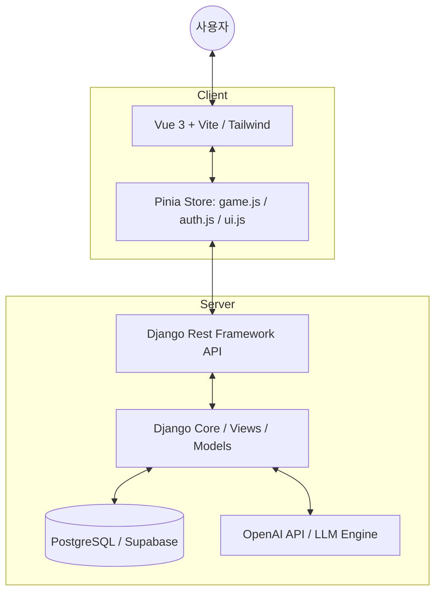

# AI-ARCADE System Master Guide (for Gemini AI)

이 문서는 AI-ARCADE 프로젝트의 핵심 아키텍처, 데이터 흐름, 로직 메커니즘을 상세히 기술하여 제미나이(AI)가 시스템을 완벽히 파악하고 개발을 지원할 수 있도록 돕는 기술 가이드입니다.

## 1. 전역 아키텍처 (Full-Stack Architecture)

AI-ARCADE는 현대적인 웹 애플리케이션 구조를 따르며, 모든 동적 요소를 데이터베이스(DB)에서 제어하는 **100% DB-Driven** 철학을 유지합니다.



## 2. 핵심 로직 패턴 (Core Logic Patterns)

### 2.1 Logic Mirror & Pseudocode Game
사용자가 의사코드(Pseudocode)를 작성하면 AI가 이를 분석하여 실제 파이썬 코드로 변환하고, 시각적 피드백을 제공하는 핵심 훈련 시스템입니다.

-   **Frontend Sync (`CodeFlowVisualizer.vue`)**:
    -   `blueprintSteps` 속성을 통해 의사코드와 파이썬 코드의 각 단계를 매핑합니다.
    -   사용자가 복구 작전 모드에서 키워드를 입력하면, `manualInput`을 검증하여 하이라이트를 제어합니다.
-   **Backend Evaluation (`pseudocode_evaluation.py`)**:
    -   **Hybrid Scoring**: 단순 키워드 체크(15%)와 OpenAI GPT를 통한 심층 아키텍처 분석(85%)을 합산합니다.
    -   **Data Leakage Detection**: `train_test_split` 이전에 `fit`이 발생하는 코드 순서 오류를 감지하면 `consistency` 점수를 가차 없이 감점합니다.

### 2.2 5차원 메트릭 (5D Performance Metrics)
사용자의 코딩 사고력을 다음 5가지 지표로 정밀 측정합니다:
1.  **Design (설계)**: 전체 파이프라인의 논리적 흐름
2.  **Consistency (일관성)**: 데이터 격리 및 전처리 원칙 준수 여부
3.  **Implementation (구현)**: 구체적인 코드 변환 가능성
4.  **Edge Case (예외처리)**: 한계 상황 및 데이터 불균형 고려
5.  **Abstraction (추상화)**: 구조적이고 효율적인 논리 구성

## 3. 데이터 모델 및 스키마 (Data Schema)

### 3.1 Practice & PracticeDetail (Separation Pattern)
훈련 콘텐츠는 계층적 ID 체계를 통해 관리됩니다.

-   **Practice (Unit)**: `id: unit01`, `unit02`...
    -   대단위 교육 과정 (예: Pseudo Code Training)
-   **PracticeDetail (Activity)**: `id: unit0101`, `unit0102`...
    -   `practice_id`를 외래키로 참조.
    -   `content_data (JSON)`: 문제 지문, 퀴즈, 시나리오, 정답 청사진(Blueprint) 등 실제 훈련 데이터 저장.

### 3.2 JSON 데이터 구조 예시 (`content_data`)
```json
{
  "mission_goal": "전처리 누수 방지",
  "critical_constraints": ["split before fit", "fit only on train"],
  "blueprint_steps": [
    { "python": "X_train, X_test = split...", "pseudo": "데이터를 격리한다." }
  ],
  "interviewQuestions": [ { "type": "CHOICE", "question": "...", "options": [...] } ]
}
```

## 4. 프론트엔드 상태 관리 (Pinia Store)

-   **`game.js`**: `initGame()` 액션을 통해 백엔드 API로부터 모든 `Practice` 목록을 비동기 로드하고, `mapDetailsToProblems()`를 거쳐 UI 컴포넌트(`QuestCard` 등)에 데이터를 매핑합니다.
-   **`ui.js`**: 시스템 전역 모달(Login, Notice, Report 등)과 토스트 알림의 상태를 제어합니다.

## 5. 확장 모듈 및 연동

-   **PDF-to-JSON**: `vllm_paper_extracted.json`과 같이 vLLM 논문에서 추출한 구조적 데이터를 기반으로 새로운 훈련 스테이지를 자동 생성하는 파이프라인.
-   **Wanted AI Crawler**: 실시간 채용 정보(`wanted_ai_list.json`)를 수집하여 사용자에게 역량 매칭 정보를 제공.

## 깃 커밋 가이드 (Rules for Gemini)
시스템 수정 시 다음 주석 규칙을 반드시 준수하십시오:
1.  **한국어 주석**: 모든 설명은 한국어로 작성.
2.  **이력 관리**: `수정일: YYYY-MM-DD`, `수정내용: 상세 설명`을 상단 혹은 해당 라인에 명시.
3.  **커밋 메시지**: 구체적인 변경 사항과 목적을 기술.

---
*Last Updated: 2026-02-18 - System Master Guide Created*
